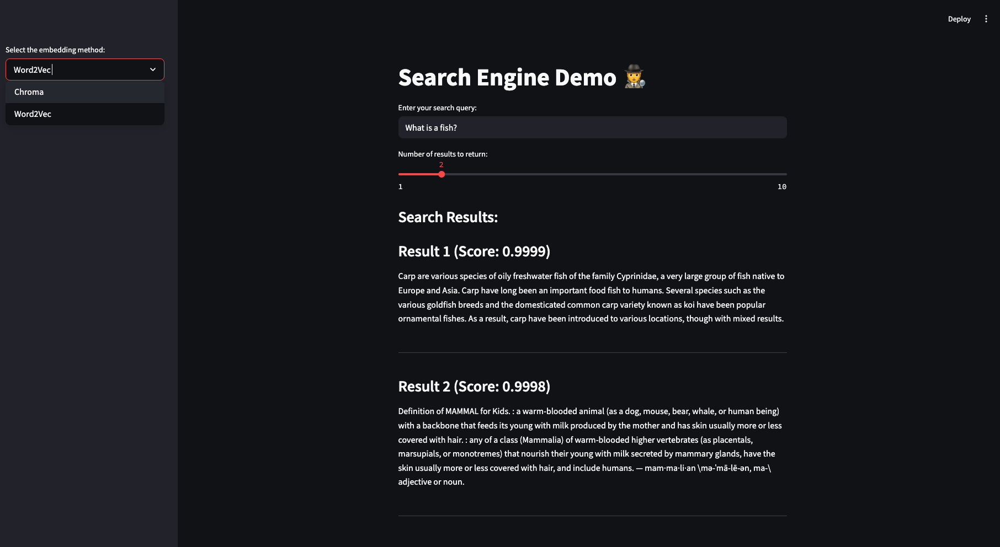

# search-engine

A search engine which takes in queries and produces a list of relevant documents using two tower architecture, trained on MS MARCO.

Semantic search is a data searching technique that focuses on understanding the contextual meaning and intent behind a user’s search query, rather than only matching keywords.



## Deliverable

- Inputs: a query, of any length
- Outputs: the $k$ ids of the most similar document

## Training

### Dataset

The MS Marco Dataset is available on HuggingFace.

In training

- Inputs: a query sentence
- Outputs: the id of the most similar document

### Word Embeddings

By default, we could use some w2v embeddings trained on text8.

### Loss function


Loss function (Hinged triplet loss)

- Want high loss when positive distances are large, and when negative distances are small
- Want no loss if the distances are 'far enough' by a margin $\Delta$

We define a triplet loss for batch size $B$, query $q_{i}$, positive sample $p_{i}^{+}$

$$L = \frac{1}{B}\sum_{i=0}^{B-1} \bigg [ \max(\text{dist}(q_{i},p_{i}^{+}) - \frac{1}{N} \sum_{j=0}^{N-1} \text{dist}(q_i,p^{-}_{i,j}) + \Delta , 0)\bigg]$$

The distance function taken is 1- cosine similarity.


Training scheme (Negative mining)

The paper proposes three types of negatives

1. Random negatives
2. BM25
3. Gold negatives

### Models

Tower MLP Architecture is defined in `Encoder`
- Input dimensions: 300, Hidden dimension: 100
- A two layer MLP with ReLU activation that operates on the average pooled documents and queries

RNN Architecture
- Input dimensions: 300


## Evaluation and Results

The best way of evaluating the model is to use a top-k accuracy.

Instead we compute the in-sample accuracy. Each training example has 1 positive and $N$ negatives.

$$\text{accuracy} = \frac{TP}{TP + FP}$$

Experiments

Tower RNN Architecture

| Setup| Last training accuracy (%) | Validation accuracy (%) | Checkpoint |
| --| --| --| --|
| Tower MLP, hard negatives| 10 | 10 | towers_mlp:v19|
|Tower MLP, random negatives | 30 | 25 | towers_mlp:v38|
| Tower MLP, Gensim weights, random negatives | 88 | 84 | towers_mlp:v39 |
| Tower RNN, Gensim weights, random negatives |  | 75 | towers_mlp:v39 |

It is good practice to greate a baseline whenever we are training a model.

| Setup| Average validation accuracy (%) |
| --| --|
| Gensim (Random negatives)  |  92 |
| Gensim (Hard negatives)  |  26 |
| Random guessing of documents  |  10 |


A baseline would be random guessing and the baseline accuracy is $1/(N+1)$. For $N = 20$, this is $4.8\%$.

Potential pitfalls

1. Word not included in the tokeniser (not in Wikipedia/ or niche words), this is especially pertinent for acronyms. Example, we had a query called 'what is rba', which turned into '['what', 'is', '<UNK>']' in tokenised form.
2. Training scheme was doing a rough-search, instead of a hard-search
3.


### Todo:

Why is training so slow?
- I can Precompute all word vectors using the skipgram model and save as a dictionary
- Profile my app
- Solved by increasing the number of workers

I'm interested in doing some ablation testing. Is the tower even needed?
- On the test set and the validation set, just dot them together

What is the top-k retrieval accuracy?
For each item in validation set, run the model and get the top-k retrieval accuracy
### Learnings:

- Embeddings are everything-- should base your project on stable foundations. preprocess data well first
- Go end-to-end quickly

Config

## Deployment

Create the relevant databases. This is most readily performed on a GPU enabled computer, but can be done on CPU as required.
- Upload uses 16 iterations per second on our own embeddings

```bash
# If on CPU
export OMP_NUM_THREADS=1
python3 create_db.py --device cpu --num_entries 2000
```

Running the search engine for the front-end

```bash
streamlit run app.py --server.port 8080
```

With docker
```bash
# Build docker image
docker build -t search .
# Bind mount the database
```


## Installation

Conda

```bash
# Install miniconda for the system
# From https://www.anaconda.com/docs/getting-started/miniconda/install#linux
mkdir -p ~/miniconda3
wget https://repo.anaconda.com/miniconda/Miniconda3-latest-Linux-x86_64.sh -O ~/miniconda3/miniconda.sh
bash ~/miniconda3/miniconda.sh -b -u -p ~/miniconda3
rm ~/miniconda3/miniconda.sh
source ~/miniconda3/bin/activate
conda init --all

# Create conda environment
conda env create --file environment.yml

# Updates conda
conda update -n base -c defaults conda

# Update environment
conda activate ss-env

# Login manually
wandb login
huggingface-cli login
```

To activate

```bash
conda activate ss-env
```

Git setup

```bash
# Add Git credentials
git config --global user.name ""
git config --global user.email ""
```

## References

Karpukhin, Vladimir, Barlas Oğuz, Sewon Min, Patrick Lewis, Ledell Wu, Sergey Edunov, Danqi Chen, and Wen-tau Yih. ‘Dense Passage Retrieval for Open-Domain Question Answering’. arXiv, 30 September 2020. https://doi.org/10.48550/arXiv.2004.04906.

The landmark paper for this is DPR, which compares it to other sparse methods like BM25. It notes
- Methods like BM25 are sensitive to highly selective keywords and phrases, but cannot capture lexical variations or semantic relationships well. In contrast, DPR excels at semantic representation, but might lack sufficient capacity to represent salient phrases which appear rarely
